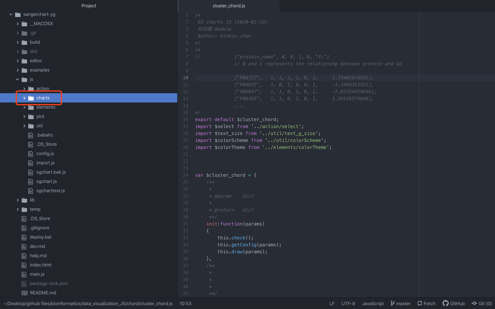

# bioinformatics
These are parts of the scripts that I wrote in the past two years.

Due to the company's confidentiality policy, I can just show part of the scripts to demonstrate my programming skills.

I was mainly involved in two projects: WGS analysis and Data visualization. 

WSG analysis is mainly done by using Python, R and Perl and Data visualization is written in JavaScript and D3.

Project details can be viewed in the corresponding folder.
